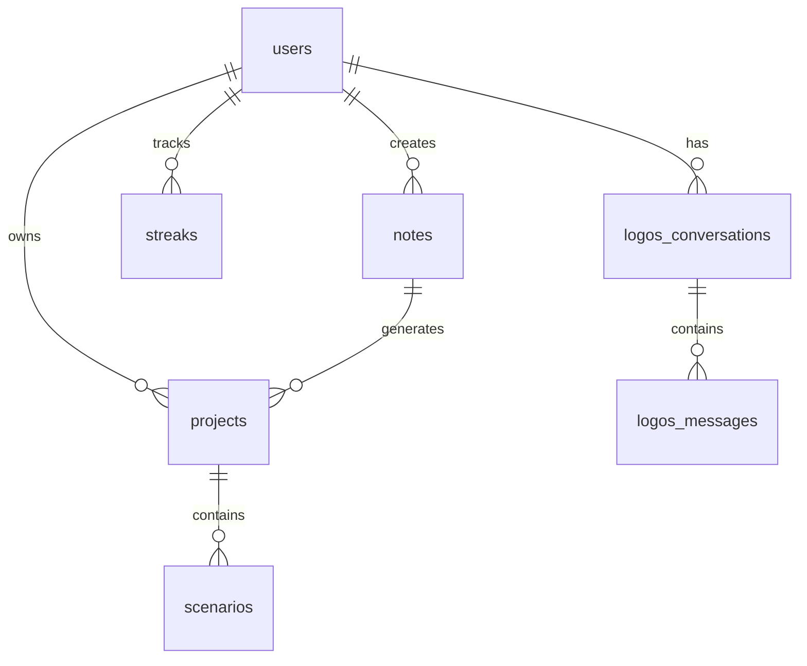

# 🌟 NEXUS - نظام إدارة الإنتاجية الذكي

<div align="center">


**نظام متكامل لإدارة الملاحظات، المشاريع، والعادات مع مساعد ذكي متقدم**

[](https://nextjs.org/)
[](https://www.typescriptlang.org/)
[](https://supabase.com/)
[](https://build.nvidia.com/)
[](https://tailwindcss.com/)
[](https://github.com/m0shaban/nexus)

[🚀 تجربة مباشرة](#quick-start) • [📖 التوثيق](#documentation) • [🤝 المساهمة](#contributing) • [🆘 الدعم](#support)

</div>

## 🎨 جديد في الإصدار v2.0

### ✨ الأيقونات والتأثيرات المتقدمة
- 🧠 **أيقونة Neural Network متحركة** للمساعد الذكي "اللوغوس"
- ⚛️ **تأثيرات Quantum و Matrix** مع حركات سلسة
- 🌟 **CSS Animations متقدمة** (spin-slow, neural-pulse, quantum-interference)
- 💫 **Gradients مخصصة** (conic, radial) للمظهر الحديث
- 🎯 **واجهة مستخدم محسنة** مع تجربة بصرية أكثر تفاعلاً

### 🤖 تحسينات المساعد الذكي
- 📝 **رسالة ترحيب موحدة** عبر جميع المكونات
- 💼 **تخصص في الاستشارات الاستراتيجية** والإنتاجية
- ⚡ **انتقالات سلسة** وتأثيرات hover محسنة
- 🔄 **أيقونة عائمة متقدمة** مع تأثيرات بصرية neural

## 📋 جدول المحتويات

- [🌟 نظرة عامة](#overview)
- [✨ الميزات الرئيسية](#features)
- [🏗️ التقنيات المستخدمة](#tech-stack)
- [🚀 البدء السريع](#quick-start)
- [⚙️ التثبيت](#installation)
- [🔧 الإعداد](#configuration)
- [🤖 الذكاء الاصطناعي](#ai-integration)
- [📊 قاعدة البيانات](#database)
- [🧪 الاختبارات](#testing)
- [📚 التوثيق](#documentation)
- [🤝 المساهمة](#contributing)
- [📄 الترخيص](#license)

## 🌟 نظرة عامة {#overview}

**NEXUS** هو نظام إدارة إنتاجية ذكي مصمم خصيصاً للمهنيين والمطورين الذين يسعون لتنظيم أفكارهم وتحقيق أهدافهم بكفاءة عالية. يجمع النظام بين إدارة الملاحظات، تتبع المشاريع، بناء العادات، ومساعد ذكي متقدم يسمى "اللوغوس".

### 🎯 الهدف
تمكين المستخدمين من:
- **تنظيم الأفكار** بطريقة منهجية وقابلة للبحث
- **تتبع المشاريع** من الفكرة إلى التنفيذ
- **بناء عادات إيجابية** مع نظام نقاط محفز
- **الحصول على نصائح استراتيجية** من مساعد ذكي متخصص

## ✨ الميزات الرئيسية {#features}

### 📝 إدارة الملاحظات المتقدمة
- **محرر Markdown** غني مع معاينة فورية
- **نظام علامات** ذكي للتصنيف والتنظيم
- **البحث المتقدم** عبر المحتوى والعلامات
- **ربط الملاحظات** لإنشاء شبكة معرفية
- **تصدير متعدد الصيغ** (PDF, Markdown, HTML)

### 🚀 إدارة المشاريع
- **تحويل الملاحظات إلى مشاريع** بنقرة واحدة
- **تتبع المراحل** من الفكرة إلى الإنجاز
- **نظام الأولويات** الذكي
- **تحليل الإنتاجية** مع مقاييس مفصلة
- **التقارير التلقائية** لحالة المشاريع

### 🏆 نظام العادات والنقاط
- **تتبع العادات اليومية** مع streak counter
- **نظام نقاط محفز** لزيادة الدافعية
- **إحصائيات مفصلة** لتقييم التقدم
- **تحديات شخصية** قابلة للتخصيص
- **مكافآت وإنجازات** عند تحقيق الأهداف

### 🤖 اللوغوس - المساعد الذكي
- **تحليل استراتيجي** للأفكار والمشاريع
- **تحدي الافتراضات** وطرح أسئلة عميقة
- **خطط تنفيذية** مخصصة وقابلة للتطبيق
- **نصائح استراتيجية** مبنية على خبرات عملية
- **تكامل مع NVIDIA AI** للاستجابات عالية الجودة

### 🎨 تجربة المستخدم الحديثة
- **تصميم متجاوب** يعمل على جميع الأجهزة
- **واجهة عربية أصيلة** مع دعم كامل للـ RTL
- **ثيمات متعددة** للتخصيص الشخصي
- **رسوم متحركة ناعمة** لتجربة سلسة
- **اختصارات لوحة المفاتيح** للاستخدام السريع

## 🏗️ التقنيات المستخدمة {#tech-stack}

### Frontend
- **[Next.js 15.3.3](https://nextjs.org/)** - React Framework للإنتاج
- **[TypeScript](https://www.typescriptlang.org/)** - لأمان الأنواع
- **[Tailwind CSS](https://tailwindcss.com/)** - للتصميم السريع
- **[Framer Motion](https://www.framer.com/motion/)** - للحركات والانتقالات
- **[Lucide React](https://lucide.dev/)** - مكتبة الأيقونات

### Backend & Database
- **[Supabase](https://supabase.com/)** - قاعدة بيانات PostgreSQL مُدارة
- **[Row Level Security (RLS)](https://supabase.com/docs/guides/auth/row-level-security)** - لأمان البيانات
- **[Real-time subscriptions](https://supabase.com/docs/guides/realtime)** - للتحديثات المباشرة

### الذكاء الاصطناعي
- **[NVIDIA NIM API](https://build.nvidia.com/)** - نماذج Llama المتقدمة
- **Llama-3.1-Nemotron-Ultra** - للاستجابات عالية الجودة
- **استراتيجيات تحسين المحادثة** - للتفاعل الطبيعي

### DevOps & Tools
- **[ESLint](https://eslint.org/)** - لجودة الكود
- **[Prettier](https://prettier.io/)** - لتنسيق الكود
- **[Vitest](https://vitest.dev/)** - للاختبارات
- **[GitHub Actions](https://github.com/features/actions)** - للـ CI/CD

## 🚀 البدء السريع {#quick-start}

### المتطلبات الأساسية
```bash
Node.js >= 18.0.0
npm >= 9.0.0
Git
```

### تشغيل سريع (5 دقائق)
```bash
# 1. استنساخ المشروع
git clone https://github.com/m0shaban/nexus.git
cd nexus

# 2. تثبيت الحزم
npm install

# 3. إعداد متغيرات البيئة
cp .env.example .env.local
# عدّل .env.local مع بياناتك

# 4. إعداد قاعدة البيانات
npm run db:setup

# 5. تشغيل الخادم
npm run dev
```

🎉 **مبروك!** النظام يعمل الآن على `http://localhost:3000`

## ⚙️ التثبيت {#installation}

### 1. استنساخ المشروع
```bash
git clone https://github.com/m0shaban/nexus.git
cd nexus
```

### 2. تثبيت التبعيات
```bash
npm install
```

### 3. إعداد متغيرات البيئة
قم بنسخ ملف `.env.example` إلى `.env.local` وملء القيم:

```bash
cp .env.example .env.local
```

#### متغيرات Supabase المطلوبة:
```env
NEXT_PUBLIC_SUPABASE_URL=your_supabase_url
NEXT_PUBLIC_SUPABASE_ANON_KEY=your_supabase_anon_key
SUPABASE_SERVICE_ROLE_KEY=your_service_role_key
```

#### متغيرات NVIDIA AI (اختيارية):
```env
NVIDIA_API_KEY=your_nvidia_api_key
NVIDIA_API_BASE_URL=https://integrate.api.nvidia.com/v1
```

### 4. إعداد قاعدة البيانات
```bash
# تشغيل جميع السكريبتات التلقائية
npm run db:setup

# أو يدوياً
npm run db:migrate
npm run db:seed
```

### 5. تشغيل التطبيق
```bash
# للتطوير
npm run dev

# للإنتاج
npm run build
npm start
```

## 🔧 الإعداد {#configuration}

### إعداد Supabase

1. **إنشاء مشروع جديد** في [Supabase Dashboard](https://app.supabase.com/)
2. **نسخ URL و API Keys** من إعدادات المشروع
3. **تشغيل السكريبتات** لإنشاء الجداول:

```bash
# في Supabase SQL Editor
-- تشغيل ملفات SQL بالترتيب:
database/db/00-master-setup.sql
database/db/01-setup-extensions.sql
database/db/02-create-users-new.sql
database/db/03-create-notes.sql
database/db/04-create-projects-new.sql
database/db/05-create-scenarios.sql
database/db/06-create-streaks.sql
database/db/07-create-mirror.sql
database/db/08-create-logos.sql
database/db/09-create-analytics-views.sql
database/db/10-create-sample-data.sql
```

### إعداد NVIDIA AI

1. **إنشاء حساب** في [NVIDIA Build](https://build.nvidia.com/)
2. **الحصول على API Key** من لوحة التحكم
3. **إضافة المفتاح** إلى `.env.local`
4. **اختبار الاتصال**:

```bash
npm run test:ai
```

### إعداد الأمان (RLS)

لتفعيل Row Level Security:

```bash
# تشغيل سياسات الأمان
npm run db:rls:setup
```

## 🤖 الذكاء الاصطناعي {#ai-integration}

### نظرة عامة على اللوغوس

اللوغوس هو مساعد ذكي متخصص في:

- **التحليل الاستراتيجي** للأفكار والمشاريع
- **طرح الأسئلة العميقة** لتحدي الافتراضات
- **تحويل الأفكار** إلى خطط قابلة للتنفيذ
- **تقديم نصائح مخصصة** حسب السياق

### استخدام API

```typescript
// إرسال رسالة للوغوس
const response = await fetch('/api/logos/chat', {
  method: 'POST',
  headers: {
    'Content-Type': 'application/json',
  },
  body: JSON.stringify({
    message: 'كيف يمكنني تحسين إنتاجيتي؟',
    userId: 'user-id',
    conversationId: 'optional-conversation-id'
  })
});

const data = await response.json();
console.log(data.message.content);
```

### تخصيص اللوغوس

يمكن تخصيص شخصية اللوغوس من خلال:

```typescript
// في src/app/api/logos/chat/route.ts
const LOGOS_SYSTEM_PROMPT = `
أنت مساعد ذكي متخصص في...
// تخصيص الشخصية والأسلوب
`;
```

## 📊 قاعدة البيانات {#database}

### هيكل قاعدة البيانات



### الجداول الرئيسية

#### `users` - المستخدمون
```sql
CREATE TABLE users (
  id UUID PRIMARY KEY DEFAULT uuid_generate_v4(),
  email VARCHAR UNIQUE NOT NULL,
  name VARCHAR NOT NULL,
  avatar_url VARCHAR,
  created_at TIMESTAMPTZ DEFAULT NOW()
);
```

#### `notes` - الملاحظات
```sql
CREATE TABLE notes (
  id UUID PRIMARY KEY DEFAULT uuid_generate_v4(),
  user_id UUID REFERENCES users(id),
  title VARCHAR NOT NULL,
  content TEXT,
  tags TEXT[],
  created_at TIMESTAMPTZ DEFAULT NOW()
);
```

#### `projects` - المشاريع
```sql
CREATE TABLE projects (
  id UUID PRIMARY KEY DEFAULT uuid_generate_v4(),
  user_id UUID REFERENCES users(id),
  title VARCHAR NOT NULL,
  description TEXT,
  status project_status DEFAULT 'idea',
  priority priority_level DEFAULT 'medium',
  created_at TIMESTAMPTZ DEFAULT NOW()
);
```

### الـ Views والإحصائيات

```sql
-- عرض إحصائيات المستخدم
CREATE VIEW user_analytics AS
SELECT 
  u.id,
  COUNT(DISTINCT n.id) as notes_count,
  COUNT(DISTINCT p.id) as projects_count,
  COUNT(DISTINCT s.id) as active_streaks
FROM users u
LEFT JOIN notes n ON u.id = n.user_id
LEFT JOIN projects p ON u.id = p.user_id
LEFT JOIN streaks s ON u.id = s.user_id AND s.is_active = true
GROUP BY u.id;
```

## 🧪 الاختبارات {#testing}

### تشغيل الاختبارات

```bash
# جميع الاختبارات
npm test

# اختبارات محددة
npm run test:unit
npm run test:integration
npm run test:e2e

# اختبار التغطية
npm run test:coverage
```

### اختبارات قاعدة البيانات

```bash
# اختبار الاتصال
npm run test:db

# اختبار الجداول
npm run test:tables

# اختبار البيانات التجريبية
npm run test:seed
```

### اختبارات الذكاء الاصطناعي

```bash
# اختبار NVIDIA API
npm run test:ai

# اختبار المحادثات
npm run test:chat

# اختبار شامل للشاتبوت
npm run test:logos
```

### اختبارات مخصصة

```bash
# في مجلد tests/
node final-comprehensive-test.mjs  # اختبار شامل
node test-logos-integration.mjs    # اختبار تكامل اللوغوس
node test-database-complete.mjs    # اختبار قاعدة البيانات
```

## 📚 التوثيق {#documentation}

### الملفات الموجودة في `docs/`

- **[FINAL_PROJECT_SUMMARY.md](docs/FINAL_PROJECT_SUMMARY.md)** - ملخص المشروع الشامل
- **[CHATBOT_SUCCESS_FINAL.md](docs/CHATBOT_SUCCESS_FINAL.md)** - تقرير نجاح الشاتبوت
- **[DATABASE_SETUP_COMPLETE_GUIDE.md](docs/DATABASE_SETUP_COMPLETE_GUIDE.md)** - دليل إعداد قاعدة البيانات
- **[PRODUCTION_READY_FINAL.md](docs/PRODUCTION_READY_FINAL.md)** - دليل النشر للإنتاج

### API Documentation

#### Notes API
```typescript
// GET /api/notes - جلب جميع الملاحظات
// POST /api/notes - إنشاء ملاحظة جديدة
// PUT /api/notes/:id - تعديل ملاحظة
// DELETE /api/notes/:id - حذف ملاحظة
```

#### Projects API
```typescript
// GET /api/projects - جلب جميع المشاريع
// POST /api/projects - إنشاء مشروع جديد
// PUT /api/projects/:id - تعديل مشروع
// DELETE /api/projects/:id - حذف مشروع
```

#### Logos Chat API
```typescript
// POST /api/logos/chat - إرسال رسالة للوغوس
// GET /api/logos/chat?conversationId=:id - جلب محادثة
```

## 🚀 النشر للإنتاج

### Vercel (موصى به)

```bash
# تثبيت Vercel CLI
npm i -g vercel

# نشر المشروع
vercel

# إعداد متغيرات البيئة في Vercel Dashboard
```

> **🚨 تنبيه مهم للإصدار v2.0:**
> إذا كان لديك نسخة منشورة على Vercel من إصدار سابق، تأكد من إعادة النشر (Redeploy) لتحديث الأيقونات الجديدة والتأثيرات البصرية المتقدمة. اذهب إلى [Vercel Dashboard](https://vercel.com/dashboard) واضغط "Redeploy" لمشروع NEXUS.

### Docker

```dockerfile
# Dockerfile متوفر في المشروع
docker build -t nexus .
docker run -p 3000:3000 nexus
```

### النشر الذاتي

```bash
# بناء المشروع للإنتاج
npm run build

# تشغيل الخادم
npm start

# أو مع PM2
pm2 start ecosystem.config.js
```

## 🔧 التخصيص

### تخصيص الثيم

```typescript
// في tailwind.config.ts
module.exports = {
  theme: {
    extend: {
      colors: {
        primary: {
          50: '#eff6ff',
          500: '#3b82f6',
          900: '#1e3a8a',
        }
      }
    }
  }
}
```

### إضافة ميزات جديدة

1. **إنشاء مكون جديد** في `src/components/`
2. **إضافة API endpoint** في `src/app/api/`
3. **تحديث قاعدة البيانات** في `database/db/`
4. **إضافة اختبارات** في `tests/`

## 🤝 المساهمة {#contributing}

نرحب بالمساهمات! يرجى قراءة [دليل المساهمة](CONTRIBUTING.md) قبل البدء.

### خطوات المساهمة

1. **Fork** المشروع
2. **إنشاء branch** للميزة الجديدة (`git checkout -b feature/amazing-feature`)
3. **Commit** التغييرات (`git commit -m 'Add amazing feature'`)
4. **Push** إلى Branch (`git push origin feature/amazing-feature`)
5. **فتح Pull Request**

### معايير الكود

- استخدم **TypeScript** لجميع الملفات الجديدة
- اتبع **ESLint** و **Prettier** configurations
- اكتب **اختبارات** للميزات الجديدة
- أضف **تعليقات** للكود المعقد
- حدّث **التوثيق** عند الحاجة

## 📄 الترخيص {#license}

هذا المشروع مرخص تحت [MIT License](LICENSE).

## 👨‍💻 الفريق

**محمد شعبان** - *المطور الرئيسي*
- GitHub: [@mohammed-shaaban](https://github.com/mohammed-shaaban)
- Email: contact@example.com
- LinkedIn: [محمد شعبان](https://linkedin.com/in/mohammed-shaaban)

## 🆘 الدعم {#support}

### طرق الحصول على المساعدة

1. **GitHub Issues** - للمشاكل التقنية والطلبات
2. **Discussions** - للأسئلة العامة والاقتراحات
3. **Email** - support@nexus.example.com
4. **Discord** - [انضم لخادم Discord](https://discord.gg/nexus)

### الأسئلة الشائعة

**س: كيف أعيد تعيين قاعدة البيانات؟**
```bash
npm run db:reset
npm run db:setup
```

**س: الشاتبوت لا يعمل؟**
```bash
# تحقق من متغيرات البيئة
npm run test:ai

# إعادة تشغيل الخادم
npm run dev
```

**س: كيف أضيف مستخدم جديد؟**
```sql
-- في Supabase SQL Editor
INSERT INTO users (email, name) VALUES 
('user@example.com', 'اسم المستخدم');
```

---

<div align="center">

**⭐ إذا أعجبك المشروع، لا تنس إعطاؤه نجمة! ⭐**

[🔝 العودة للأعلى](#-nexus---نظام-إدارة-الإنتاجية-الذكي)

</div>

---

## 👨‍💻 المطور والمالك

<div align="center">

### **محمد شعبان**
*مهندس ميكاترونكس وخبير الذكاء الاصطناعي*

[](https://www.linkedin.com/in/moshabann/)
[](mailto:ENG.MOHAMED0SHABAN@GMAIL.COM)
[](tel:+201121891913)

**📧 البريد الإلكتروني:** ENG.MOHAMED0SHABAN@GMAIL.COM  
**📞 الهاتف:** +201121891913  
**🔗 LinkedIn:** https://www.linkedin.com/in/moshabann/

</div>

### 💼 عن المطور

محمد شعبان مهندس ميكاترونكس متخصص في الذكاء الاصطناعي والروبوتات، مع خبرة واسعة في:

- 🤖 **الذكاء الاصطناعي** وتطبيقاته العملية
- 🏗️ **هندسة البرمجيات** الحديثة
- 📊 **أنظمة إدارة الإنتاجية** والأتمتة
- 🎯 **الاستراتيجية التقنية** والحوكمة

### 📜 حقوق الملكية الفكرية

© 2025 **محمد شعبان** - جميع الحقوق محفوظة

هذا المشروع محمي بموجب **ترخيص تجاري مخصص**. للمزيد من التفاصيل:
- 📄 [ملف الترخيص](LICENSE)
- 📋 [تفاصيل الملكية](OWNERSHIP.md)

### 🤝 للاستخدام التجاري

إذا كنت مهتماً باستخدام NEXUS في مشروع تجاري، يرجى التواصل معي:

- **💼 الاستشارات التقنية**
- **🔧 التخصيص والتطوير**
- **🚀 التكامل المؤسسي**
- **📈 التدريب والدعم**

---

### 🌟 **تم تطوير هذا المشروع كجزء من رؤية محمد شعبان لمستقبل أنظمة الإنتاجية الذكية**
